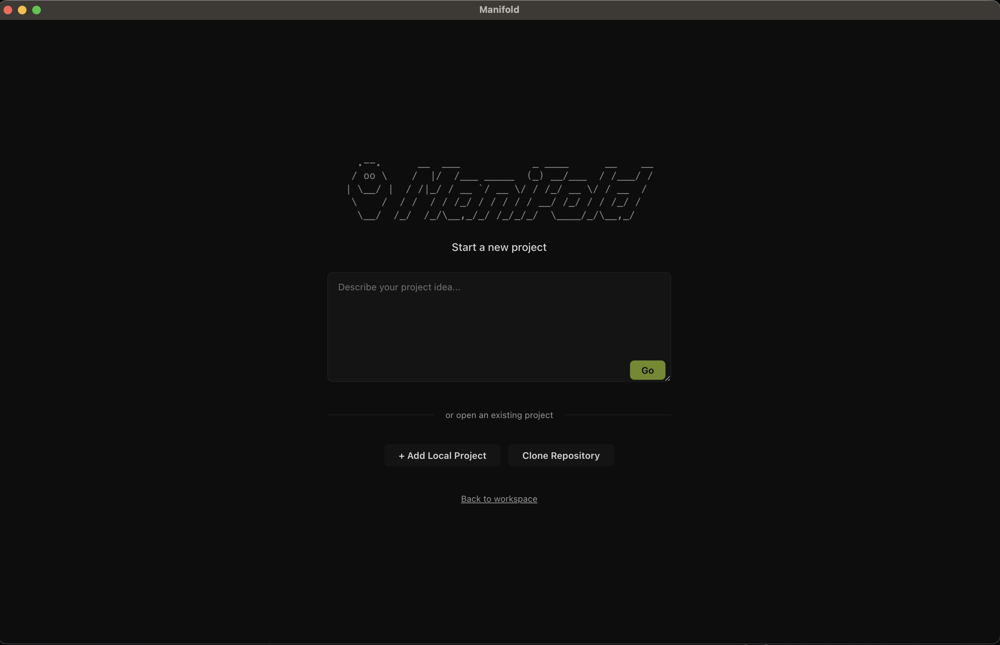

# Manifold
 
A macOS desktop app that orchestrates multiple CLI coding agents working in parallel on the same project. Each agent runs in its own git worktree, so agents can work on isolated branches simultaneously without conflicts.

Supports **Claude Code**, **Codex**, and **Gemini CLI**.

Agents run in a native terminal — no wrapping, no abstractions. You get the full CLI experience exactly as if you ran the agent yourself.

## Install

Download the latest `.dmg` from [GitHub Releases](https://github.com/svenmalvik/manifold/releases), open it, and drag Manifold to your Applications folder.

### Prerequisites

You need at least one agent CLI installed:

| Agent | Install |
|---|---|
| Claude Code | `npm install -g @anthropic-ai/claude-code` |
| Codex | `npm install -g @openai/codex` |
| Gemini CLI | `npm install -g @anthropic-ai/gemini-cli` |

Git must be installed. For creating PRs from within Manifold, install the [GitHub CLI](https://cli.github.com/) (`gh`).

## Usage

### First launch

On first launch, Manifold shows a welcome screen where you:

1. **Configure storage** — Choose where agent worktrees are stored (defaults to `~/.manifold/`)
2. **Register a repository** — Add a local git repository or clone one from GitHub

### Creating agents

1. Click **New Agent** in the sidebar
2. Pick a **runtime** (Claude Code, Codex, Gemini CLI, or a custom binary)
3. Give the agent a **prompt** describing what to do
4. Optionally edit the **branch name** (auto-generated, always prefixed `manifold/`)
5. Click **Launch**

Each agent gets its own git worktree branched from the project's main branch. Agents work in fully isolated copies of the codebase, so they never step on each other.

### Working with agents

- **Terminal pane** (left) — Live agent output streamed via xterm.js. Type into the terminal at any time to steer the agent mid-flight.
- **Code viewer** (center) — See file diffs or full file contents as the agent makes changes. Powered by Monaco Editor.
- **File tree** (right) — Browse all files in the agent's worktree. Modified files are marked with a dot.
- **Shell tabs** (bottom) — Open additional shell terminals in the agent's worktree for manual inspection.

Status badges show each agent's state: **running**, **waiting** (for user input), **done**, or **error**.

### Creating pull requests

When an agent finishes, click **Create PR** on the agent tab. Manifold uses the GitHub CLI (`gh`) to open a pull request from the agent's worktree branch to the project's base branch. Title and description are pre-filled for review.

### Key features

- **Parallel agents** — Run multiple agents on the same project simultaneously, each in an isolated worktree
- **Agent-agnostic** — Works with any CLI coding tool
- **AI-assisted commits** — Auto-generate commit messages from diffs
- **Conflict detection** — Alerts when merge conflicts appear in a worktree
- **Persistent sessions** — Agent state, shell tabs, and UI layout survive app restarts
- **35+ themes** — Switch in settings. Includes two custom Manifold themes plus popular community themes (see full list below)

## Themes

Manifold ships with 35+ editor themes including two custom Manifold themes and popular community favorites like Dracula, Nord, Monokai, and Solarized. Change the theme in **Settings**.

## Contributing

See [CONTRIBUTING.md](CONTRIBUTING.md) for setup instructions, project structure, code conventions, and pull request workflow.

## Architecture

Electron three-process model with strict context isolation:

- **Main** (`src/main/`) — Node.js runtime. Owns PTY processes, git worktrees, file system, settings.
- **Preload** (`src/preload/`) — IPC bridge. Whitelisted channels only.
- **Renderer** (`src/renderer/`) — React UI. No direct Node.js access.

### Main process modules

| Module | Role |
|---|---|
| `SessionManager` | Agent session lifecycle — create, resume, kill, discover dormant worktrees |
| `WorktreeManager` | Git worktree creation/removal under configurable `storagePath` |
| `PtyPool` | PTY process management via `node-pty` |
| `ProjectRegistry` | CRUD for registered projects (`~/.manifold/projects.json`) |
| `SettingsStore` | Config persistence (`~/.manifold/config.json`) |
| `StatusDetector` | Pattern-matches PTY output to detect agent status |
| `DiffProvider` | Git diff between worktree branch and base branch |
| `FileWatcher` | Watches worktree directories, pushes change events to renderer |
| `GitOperationsManager` | Commit, AI-generated commit messages, ahead/behind counts, conflict resolution |
| `PrCreator` | Creates GitHub PRs via `gh` CLI for agent worktree branches |
| `ShellTabStore` | Persists shell tab layout per worktree across app restarts |
| `ViewStateStore` | Persists per-session UI state (open files, active tab, code view mode) |
| `BranchNamer` | AI-generated branch name suggestions from task descriptions |
| `Runtimes` | Discovers available agent CLIs on the system |

### Tech stack

| Layer | Technology |
|---|---|
| App framework | Electron |
| Frontend | React 18, TypeScript |
| Terminal | xterm.js + node-pty |
| Code viewer | Monaco Editor |
| Git operations | simple-git |
| Build | electron-vite + electron-builder |
| Testing | Vitest |
