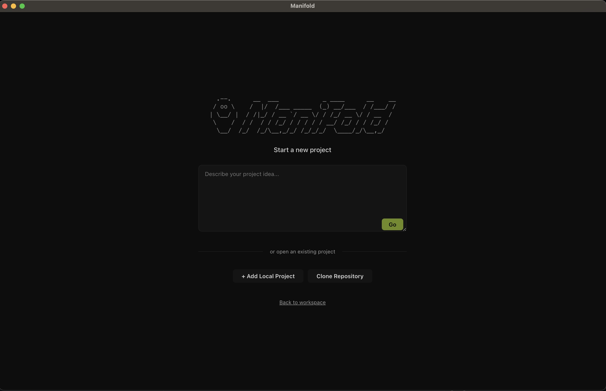

# Manifold

Manifold is a macOS desktop app for running CLI coding agents side by side on the same codebase.

It gives each agent its own git worktree when you want isolation, keeps the agent in a real terminal instead of a wrapper UI, and adds the workspace tools you need around it: code browsing, diffs, shell tabs, search, previews, commits, and pull requests.

Supports the built-in runtimes in this repo today: **Claude Code**, **Codex**, **Copilot**, **Gemini CLI**, and **Ollama-backed Claude/Codex**.



## Highlights

- Run multiple agents in parallel on one repository without branch collisions
- Use the full agent terminal directly, with live PTY output and manual input at any time
- Switch between a full **Developer** workspace and a lightweight **Simple** app-builder view
- Launch work on a new branch, the current branch, an existing branch, or an open PR
- Review changes with diffs, a file tree, split editors, shell tabs, and embedded localhost previews
- Search code, captured session memory, or both, with optional AI answer/rerank modes
- Keep project state, chat history, dock layout, open files, and shell tabs across restarts

## Install

Download the latest `.dmg` from the repository's GitHub Releases page, open it, and drag Manifold to `Applications`.

### Requirements

| Requirement | Notes |
| --- | --- |
| macOS | The packaged app and build scripts currently target macOS only. |
| Git | Required for repository management, worktrees, diffs, commits, and PR flows. |
| One supported CLI agent on your `PATH` | Manifold checks for the runtime binaries directly. |
| GitHub CLI (`gh`) | Optional, but required for creating pull requests from inside the app. |
| Ollama + at least one pulled model | Optional, only needed for the Ollama-backed runtimes. |

### Runtime Binaries

| Runtime | Binary Manifold looks for | Notes |
| --- | --- | --- |
| Claude Code | `claude` | Used in both Developer and Simple view. |
| Codex | `codex` | Used in both Developer and Simple view. |
| Copilot | `copilot` | Available in the built-in runtime list. |
| Gemini CLI | `gemini` | Available in both Developer and Simple view. |
| Claude Code (Ollama) | `ollama` | Launches through `ollama launch claude`; model selection is required. |
| Codex (Ollama) | `ollama` | Launches through `ollama launch codex`; model selection is required. |

On startup, Manifold resolves your login-shell `PATH` and appends common binary directories like `~/.local/bin`, `/opt/homebrew/bin`, and `/usr/local/bin` so CLIs installed outside Finder's default environment still show up.

## Two Modes

Manifold ships with two separate renderer experiences and lets you switch between them from the app.

### Simple View

Simple view is the default UI mode on a fresh install.

It is optimized for quickly building local web apps from chat:

- Creates a managed project under your Manifold storage directory
- Uses your configured default runtime to scaffold and iterate on the app
- Constrains the generated app to a local stack: **React 19**, **TypeScript**, **Vite**, **Dexie/IndexedDB**, and **CSS Modules**
- Runs `npm install` and `npm run dev` so the preview can come up immediately
- Persists chat history and reopens existing apps from the dashboard
- Lets you jump into Developer view for the same project when you need terminals, diffs, or git tools

Simple view is intended for local prototyping and iteration. Deployment is not implemented yet.

### Developer View

Developer view is the full workspace for repository work.

The layout is dockable rather than fixed, and the current panel set includes:

- Repositories sidebar
- Agent terminal
- Search
- File tree
- Modified files
- Shell tabs
- Web preview
- One or more editor panes

Key developer workflows:

- Open an existing local repository or clone one from GitHub
- Start an agent on a fresh `manifold/*` worktree branch
- Start an agent directly on the current branch when you do not want a worktree
- Continue work from an existing branch or from an open pull request
- Resume a stopped agent in place
- Generate commit messages and PR copy with the same runtime the session used
- Detect merge conflicts and inspect ahead/behind state against the configured base branch

## Typical Workflow

### Work On An Existing Repository

1. Open a local repo or clone one from the welcome/onboarding flow.
2. Pick a project in the sidebar.
3. Launch an agent.
4. Watch output in the terminal, steer it manually when needed, and review changes in the editor and diff views.
5. Commit from the status bar and create a PR through `gh` when the branch is ready.

### Launching Agents

In Developer view, a new agent can start in four ways:

- **New branch**: the default path, using a dedicated git worktree
- **Current branch**: runs directly in the project checkout (`noWorktree`)
- **Existing branch**: continue work already in progress
- **Open pull request**: fetch/select a PR branch and continue from there

Agent states shown in the UI are `running`, `waiting`, `done`, and `error`.

### Building Apps In Simple View

1. Create a new app card.
2. Describe the app you want.
3. Let the runtime scaffold the project and start the dev server.
4. Continue iterating through chat while previewing the app live.
5. Switch to Developer view when you need direct file, terminal, or git access.

## Search And Memory

Developer view includes a search system that goes beyond file text search.

- Search modes: `code`, `memory`, or `everything`
- Search scopes: active session, project sessions, or broader workspace context depending on mode
- Match modes: literal or regex
- Saved searches and recent searches are persisted per project
- `Ask AI` can answer grounded questions from retrieved results or rerank exact results, depending on settings

Manifold also captures session data locally and stores it per project in SQLite:

- interactions
- observations
- session summaries

That memory is used for search and for context injection/compression when sessions are resumed.

## Local Data

By default, Manifold stores its state under `~/.manifold/`.

| Path | Purpose |
| --- | --- |
| `~/.manifold/config.json` | User settings |
| `~/.manifold/projects.json` | Registered projects |
| `~/.manifold/memory/*.db` | Per-project SQLite memory stores |
| `~/.manifold/debug.log` | Debug logging |
| `<storagePath>/worktrees/...` | Managed git worktrees |
| `<storagePath>/projects/...` | Simple-view app projects |

The storage root is configurable in Settings.

## Local Development

### Prerequisites

- Node.js 18+
- npm
- macOS
- Git
- At least one supported CLI runtime installed locally

### Commands

```bash
npm install
npm run dev
npm run build
npm run typecheck
npm test
```

Useful additional commands:

```bash
npm run typecheck:node
npm run typecheck:web
npm run test:watch
```

`npm run dev` and `npm start` automatically rebuild the native Electron modules they depend on.

## Architecture

Manifold follows Electron's multi-process model with strict context isolation:

- `src/main/`: PTYs, git/worktree operations, search, memory, settings, and app lifecycle
- `src/preload/`: whitelisted IPC bridges for Developer and Simple view
- `src/renderer/`: the Developer workspace UI
- `src/renderer-simple/`: the Simple app-builder UI
- `src/shared/`: shared types, defaults, prompts, and theme data

Important main-process services include:

- `SessionManager` for agent lifecycle and session discovery
- `WorktreeManager` and `BranchCheckoutManager` for repository isolation/worktree flows
- `PtyPool` for terminal processes
- `GitOperationsManager` and `PrCreator` for commit/PR workflows
- `DevServerManager` for local preview sessions in Simple view
- `MemoryStore`, `MemoryCapture`, `MemoryCompressor`, and `MemoryInjector` for local memory
- search services for exact search, AI reranking, and AI-grounded answers

Renderer-side previews are restricted to localhost webview URLs.

## External Provisioners

Manifold supports external repository provisioners through a versioned CLI protocol.

To build one, see [docs/external-provisioners.md](docs/external-provisioners.md).

## Contributing

See [CONTRIBUTING.md](CONTRIBUTING.md) for contributor setup, code conventions, test commands, and PR workflow.

## Releasing

Releases happen in two steps so the version bump lands on `main` before the tag is created.

1. Prepare the release PR:

```bash
./release.sh patch
./release.sh minor
./release.sh major
```

2. After that PR is merged, publish the release:

```bash
./release.sh publish
```
