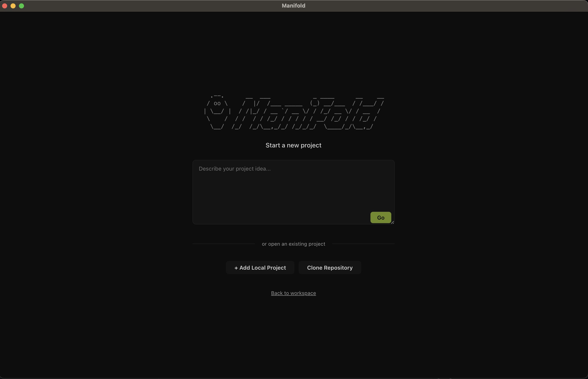

# Manifold

Manifold is a macOS desktop app for running AI coding assistants (Claude Code, Codex, Gemini CLI, and others) side by side on the same codebase.

Each agent gets its own git worktree (a separate checkout of the repository on a dedicated branch) when you want isolation, so multiple agents can work on the same repo without branch conflicts. Agents run in real terminals, not wrapper UIs, so you can read and steer their output directly.

Around the terminals, Manifold adds the workspace tools you'd expect: code browsing, diffs, shell tabs, search, previews, commits, and pull requests.

Supported runtimes: **Claude Code**, **Codex**, **Copilot**, **Gemini CLI**, and **Ollama-backed Claude/Codex**.



## Highlights

- Run multiple agents in parallel on one repository without branch collisions
- Use the full agent terminal directly, with live streaming output and manual input at any time
- Switch between a full **Developer** workspace and a lightweight **Simple** app-builder view
- Launch work on a new branch, the current branch, an existing branch, or an open pull request
- Coordinate multiple agents across repositories with **Superagent** sessions, with per-tool approvals
- Run automated **Loop** cycles that prompt an agent, evaluate the result, and commit on improvement or revert on regression
- Review changes with diffs, a file tree, split editors, shell tabs, and embedded localhost previews
- Search code, captured session memory, or both, with an optional AI mode that answers questions or surfaces the most relevant results
- Keep project state, chat history, dock layout, open files, and shell tabs across restarts

## Install

Download the latest `.dmg` from the [GitHub Releases page](https://github.com/vippsas/manifold/releases), open it, and drag Manifold to `Applications`.

### Requirements

| Requirement | Notes |
| --- | --- |
| macOS | The packaged app and build scripts currently target macOS only. |
| Git | Required for repository management, worktrees, diffs, commits, and pull request flows. |
| One supported CLI agent on your `PATH` | Manifold checks for the runtime binaries directly. |
| GitHub CLI (`gh`) | Optional, but required for creating pull requests from inside the app. |
| Ollama + at least one pulled model | Optional, only needed for the Ollama-backed runtimes. |

### Runtime Binaries

| Runtime | Binary Manifold looks for | Install | Notes |
| --- | --- | --- | --- |
| Claude Code | `claude` | [claude.com/claude-code](https://www.claude.com/product/claude-code) | Used in both Developer and Simple view. |
| Codex | `codex` | [github.com/openai/codex](https://github.com/openai/codex) | Used in both Developer and Simple view. |
| Copilot | `copilot` | [github.com/github/copilot-cli](https://github.com/github/copilot-cli) | Available in the built-in runtime list. |
| Gemini CLI | `gemini` | [github.com/google-gemini/gemini-cli](https://github.com/google-gemini/gemini-cli) | Available in both Developer and Simple view. |
| Claude Code (Ollama) | `ollama` | [ollama.com](https://ollama.com) | Launches through `ollama launch claude`; model selection is required. |
| Codex (Ollama) | `ollama` | [ollama.com](https://ollama.com) | Launches through `ollama launch codex`; model selection is required. |

On startup, Manifold reads the `PATH` from your shell profile and appends common binary directories like `~/.local/bin`, `/opt/homebrew/bin`, and `/usr/local/bin` so CLIs installed via Homebrew or similar tools are found even when Manifold is launched from Finder.

### Verify Your Setup

Before launching Manifold, confirm the prerequisites are reachable from your shell:

```bash
git --version            # any recent Git
gh --version             # optional, needed for pull request creation
claude --version         # or: codex --version / gemini --version / copilot --version
```

If a runtime command is not found, install it (see the links above) and make sure its binary is on your `PATH`.

## Two Modes

Manifold ships with two UI modes and lets you switch between them from within the app.

### Simple View

Simple view is the default UI mode on a fresh install.

It is optimized for quickly building local web apps from chat:

- Creates a project folder under your Manifold storage directory and tracks it automatically
- Uses the default runtime you set in Settings to scaffold and iterate on the app
- Constrains the generated app to a local stack: **React 19**, **TypeScript**, **Vite**, **Dexie/IndexedDB** (browser-local database), and **CSS Modules**
- Runs `npm install` and `npm run dev` so the preview can come up immediately
- Persists chat history and reopens existing apps from the dashboard
- Lets you jump into Developer view for the same project when you need terminals, diffs, or git tools

Simple view is intended for local prototyping and iteration. Deployment is not implemented yet.

### Developer View

Developer view is the full workspace for repository work.

Panels can be shown, hidden, and rearranged to suit your workflow. The current panel set includes:

- Repositories sidebar
- Agent terminal
- Search
- File tree
- Modified files
- Shell tabs
- Web preview
- One or more editor panes

Key developer workflows:

- Open an existing local repository or clone one from GitHub
- Start an agent on a fresh worktree branch (branches are named `manifold/<description>` automatically)
- Start an agent directly on the current branch when you do not want a worktree
- Continue work from an existing branch or from an open pull request
- Resume a stopped agent in place
- Generate commit messages and pull request descriptions using the same agent runtime the session used
- Detect merge conflicts and see how many commits your branch is ahead of or behind the base branch

## Typical Workflow

### Work On An Existing Repository

1. Open a local repo using the **Add Project** button, or clone one from the welcome screen.
2. Pick a project in the sidebar.
3. Launch an agent with a task description, for example:

   > Add input validation to the login form and write unit tests for the new checks.

4. Watch output in the terminal, steer it manually when needed, and review changes in the editor and diff views.
5. Commit from the status bar and open a pull request through `gh` when the branch is ready.

### Launching Agents

In Developer view, a new agent can start in four ways:

- **New branch**: the default path, using a dedicated git worktree
- **Current branch**: runs directly in the project checkout, without creating a separate worktree
- **Existing branch**: continue work already in progress
- **Open pull request**: select an open pull request, check out its branch, and continue work from there

Agent states shown in the UI are `running`, `waiting`, `done`, and `error`.

### Building Apps In Simple View

1. Create a new app card.
2. Describe the app you want, for example:

   > A to-do list app with local storage, where items can be checked off and deleted.

3. Let the runtime scaffold the project and start the dev server.
4. Continue iterating through chat while previewing the app live.
5. Switch to Developer view when you need direct file, terminal, or git access.

## Superagent

A **Superagent** is a special Claude Code agent that acts as a coordinator — it spawns and supervises other agents across multiple repositories through a local tool server (MCP).

- Lives in its own sidebar section, separate from single-repository agents
- Spawns child agents on any registered repository and streams their output back
- Requires approval for each tool call that modifies files or runs commands, with an option to auto-approve for the session
- Shows overall status based on all child agents: `running` if any are still working, `error` if any failed, `done` when all finish
- Uses a two-pane layout: the orchestrating agent's terminal alongside a list of child agents and any pending approvals

Superagents are useful when a task spans several repositories at once — for example, landing a change that touches both a backend and a frontend repo, or running the same refactor across many services.

## Automated Loop

The **Loop** dock panel runs an automated improve-and-evaluate cycle on an agent session:

1. Prompt the agent with your instruction
2. Run a user-defined evaluation command
3. Extract a numeric score from the result (process exit code, a regex match on stdout, or a JSON field)
4. Commit the changes if the score improved, or discard them and revert to the previous state if it regressed
5. Repeat until you stop it or the maximum number of iterations is reached

Each iteration has a configurable time limit; if the agent exceeds it, Manifold stops it automatically. Results are logged to `.manifold/loop.jsonl` inside the worktree. The panel tracks the best score so far and offers **Restore Best** to jump back to the commit that produced it.

## Search And Memory

Developer view includes a search system that goes beyond file text search.

- Search modes: `code` (file contents), `memory` (captured session data), or `everything` (both)
- Search scopes: the current session, all sessions for the current project, or across all registered projects — depending on mode
- Match modes: literal or regex
- Saved searches and recent searches are persisted per project
- `Ask AI` can answer questions using the retrieved results as context, or re-sort exact matches by relevance, depending on settings

Manifold also captures session data locally and stores it per project in SQLite:

- **interactions** — prompts sent and responses received
- **observations** — facts the agent noted during a session
- **session summaries** — compressed overviews used when resuming long sessions

That memory is used for search and to give the agent relevant history when a session is resumed.

## Local Data

By default, Manifold stores its state under `~/.manifold/`.

| Path | Purpose |
| --- | --- |
| `~/.manifold/config.json` | User settings (storage path, default runtime, theme, etc.) |
| `~/.manifold/projects.json` | Registered projects (name, path, base branch) |
| `~/.manifold/memory/*.db` | Per-project SQLite memory stores |
| `~/.manifold/debug.log` | Debug log — check here first when something goes wrong |
| `~/.manifold/worktrees/...` | Managed git worktrees (default location) |
| `~/.manifold/projects/...` | Simple-view app projects (default location) |

The storage root (`~/.manifold` by default) is configurable in Settings → Storage Path.

## Local Development

### Prerequisites

- Node.js 18+
- npm
- macOS
- Git
- At least one supported CLI runtime installed locally

### Get The Source

```bash
git clone https://github.com/vippsas/manifold.git
cd manifold
```

### Commands

| Command | Purpose |
| --- | --- |
| `npm install` | Install dependencies. Run once after cloning, and again when `package.json` changes. |
| `npm run dev` | Launch Electron in development mode with hot reload via electron-vite. Auto-rebuilds native modules. |
| `npm start` | Run the built app locally. Also auto-rebuilds native Electron modules. |
| `npm run build` | Produce a production build of main, preload, and renderer bundles. |
| `npm run dist` | Build and package a macOS `.dmg` for distribution. |
| `npm run typecheck` | Full TypeScript check (runs both `typecheck:node` and `typecheck:web`). |
| `npm run typecheck:node` | Typecheck main process, preload, and shared code (`tsconfig.node.json`). |
| `npm run typecheck:web` | Typecheck renderer and shared code (`tsconfig.web.json`). |
| `npm test` | Run the full vitest suite once. |
| `npm run test:watch` | Run vitest in watch mode while iterating on tests. |

Before opening a pull request, make sure `npm run typecheck` and `npm test` both pass.

## Architecture

Manifold follows Electron's multi-process model, where the UI has no direct access to Node.js or the filesystem — all system calls go through a controlled bridge:

- `src/main/`: terminal processes (PTYs), git/worktree operations, search, memory, settings, and app lifecycle
- `src/preload/`: the bridge layer — whitelists which Node.js operations the UI is allowed to call
- `src/renderer/`: the Developer workspace UI
- `src/renderer-simple/`: the Simple app-builder UI
- `src/shared/`: shared types, defaults, prompts, and theme data

Important main-process services include:

- `SessionManager` for starting, stopping, and resuming agent sessions, and finding existing worktrees on disk
- `WorktreeManager` and `BranchCheckoutManager` for creating, switching, and removing git worktrees
- `PtyPool` for terminal processes
- `GitOperationsManager` and `PrCreator` for generating commits, commit messages, and opening GitHub pull requests
- `DevServerManager` for local preview sessions in Simple view
- `MemoryStore` (SQLite storage), `MemoryCapture` (records session data), `MemoryCompressor` (summarises long sessions), and `MemoryInjector` (provides history to resumed sessions)
- search services for exact text search, AI-sorted results, and AI-answered questions

For security, embedded web previews are limited to `localhost` URLs only — they cannot load external sites.

## External Provisioners

Manifold supports external plugins that can create and configure repositories on demand, communicating with Manifold through a versioned command-line protocol.

To build one, see [docs/external-provisioners.md](docs/external-provisioners.md).

## Contributing

Contributions are welcome. A quick outline:

1. Fork the repo and create a branch from `main`.
2. Follow the [Local Development](#local-development) steps to get the app running.
3. Make your change, keeping it focused and small where possible.
4. Run `npm run typecheck` and `npm test` — both must pass.
5. Open a pull request describing the change and the testing you ran.

See [CONTRIBUTING.md](CONTRIBUTING.md) for the full contributor setup, code conventions, test commands, and pull request workflow.

## License

Manifold is released under the MIT License. See [LICENSE](LICENSE) for the full text.

## Releasing

Releases happen in two steps so the version bump lands on `main` before the tag is created.

1. Prepare the release PR (choose one based on the change):

```bash
./release.sh patch   # bug fixes and small changes
./release.sh minor   # new features, backwards compatible
./release.sh major   # breaking changes
```

2. After that PR is merged, publish the release:

```bash
./release.sh publish
```
