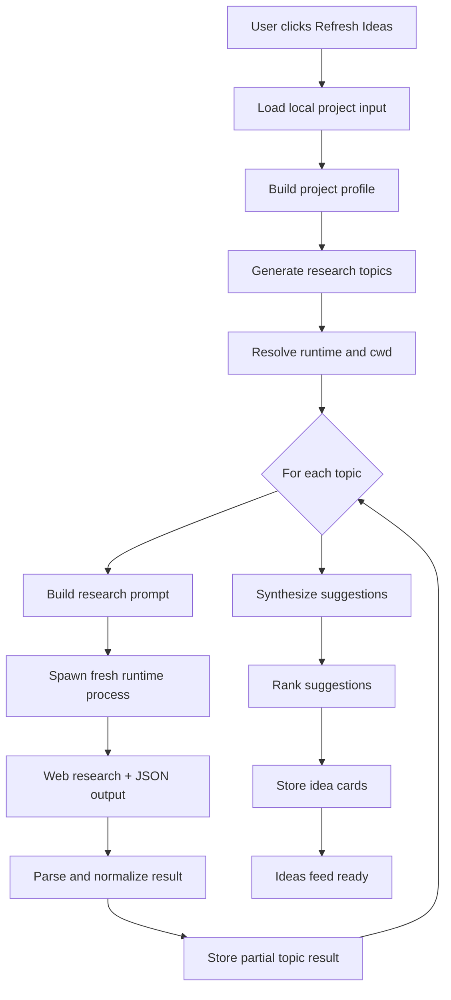
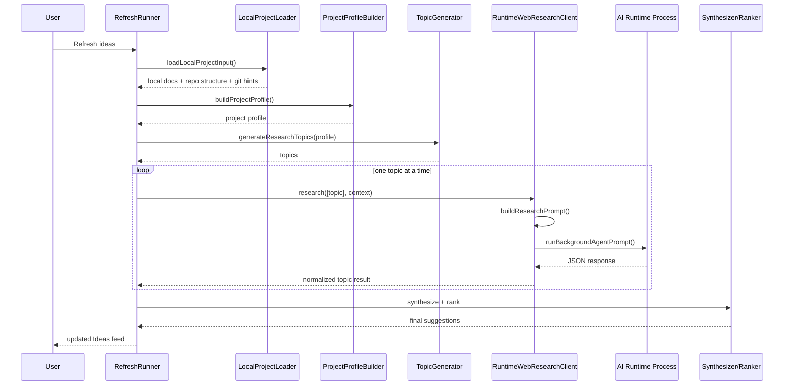

# Current Background-Agent Research Flow

This document describes how the Ideas refresh works today in code.

## Short answer

No, the system is not running one agent once.

Today, one Ideas refresh does this:

1. Build a local project profile from repository files and git metadata.
2. Generate a small fixed set of research topics from that profile.
3. Run the selected AI runtime once per topic, sequentially.
4. Parse, synthesize, rank, and store the resulting idea cards.

So the current design is:

- one selected runtime per refresh
- multiple fresh non-interactive runtime invocations per refresh
- sequential topic processing
- no parallel multi-agent orchestration yet

In practice, the default topic generator currently produces up to 4 topics, so a single refresh usually means up to 4 separate AI research calls.

## What happens during a refresh

The refresh starts in `BackgroundAgentRefreshRunner.runFresh()`.

### 1. Load local project context

The system loads local repository material before any web research happens.

Current inputs include:

- `package.json` metadata
- repo structure summary
- README files
- top-level markdown notes
- markdown under `docs/`
- recent git log subjects
- current git status hints

This happens in `loadLocalProjectInput()`.

### 2. Build a project profile

The loader output is turned into a normalized `BackgroundAgentProjectProfile`.

The profile includes fields like:

- project name
- summary
- product type
- target user
- major workflows
- architecture shape
- dependency stack
- open questions
- recent changes

This step is heuristic code, not an AI call.

### 3. Generate research topics

The current implementation derives a small topic set from the profile.

Today those topics are:

- competitor feature patterns
- workflow transfer patterns
- architecture and interaction patterns
- ecosystem shifts

This step is also deterministic code, not an AI call.

### 4. Resolve which runtime to use

The system picks one runtime for the refresh:

- active session runtime if there is an active session
- otherwise the default runtime from settings

It also picks the working directory:

- active session worktree if available
- otherwise the project root

Important: this does not attach to a live interactive agent conversation. The runtime context is marked as `non-interactive`.

### 5. Research each topic sequentially

This is the key behavior.

`continueRefresh()` loops through topics one by one and calls `webResearchClient.research()` with a single-topic array each time. That means research is currently serial, not parallel.

For each topic:

- build a prompt from:
  - the project profile
  - the current topic
  - source and suggestion limits
- call `runBackgroundAgentPrompt()`
- parse the JSON response
- normalize findings, sources, and candidate suggestions
- persist partial progress so refresh can pause/resume

### 6. Spawn a fresh runtime process for each research call

`runBackgroundAgentPrompt()` calls `gitOps.aiGenerate()`.

`aiGenerate()` uses `spawn(...)` to launch the runtime command as a fresh child process for that prompt. It does not reuse a long-lived agent process for research.

That means the current system is closer to:

- "one-shot prompt execution per topic"

than:

- "a persistent research agent collaborating over multiple steps"

### 7. Synthesize and rank suggestions

After all topic runs finish:

- topic-level candidate suggestions are merged
- sources are normalized and deduplicated
- weakly evidenced suggestions are filtered
- remaining suggestions are ranked
- top suggestions are stored in the Ideas feed

## Mermaid diagram

## Sequence view

## What this means today

### What it is

- a profile-driven research pipeline
- a sequential set of one-shot AI research calls
- a post-processing step that turns raw topic results into ranked suggestions

### What it is not

- not one single AI call for the whole refresh
- not one persistent research agent session
- not a parallel multi-agent system
- not yet a planner that decomposes work into cooperating specialist agents

## Current implementation characteristics

### Strengths

- simple control flow
- easy to pause and resume between topics
- bounded cost and latency
- explicit structured outputs per topic

### Limitations

- no parallelism across topics
- no cross-topic iterative planning by the model
- each topic starts from a fresh process, so there is no persistent research memory inside the runtime
- topic generation is fixed and heuristic
- the project profile is heuristic and may underspecify domain-specific repositories

## If we want a more agentic version later

The likely next steps would be:

- improve project-profile generation, potentially with AI-assisted summarization
- support parallel topic execution
- add a planner step that decides which topics are worth researching
- introduce persistent research state across topic runs
- move from "fresh process per topic" toward explicit multi-agent orchestration when justified

## Code map

- Refresh orchestration: `src/main/background-agent-host/background-agent-refresh-runner.ts`
- Local repo loading: `background-agent/connectors/local-project/local-project-loader.ts`
- Project profile building: `background-agent/core/project-profile/project-profile-builder.ts`
- Topic generation: `background-agent/core/research/research-topic-generator.ts`
- Prompt building: `src/main/background-agent-host/background-agent-research-prompt.ts`
- Runtime research client: `src/main/background-agent-host/background-agent-research-client.ts`
- Runtime execution: `src/main/background-agent-host/background-agent-runtime.ts`
- Process spawning: `src/main/git/git-operations.ts`
- Synthesis: `background-agent/core/synthesis/suggestion-synthesizer.ts`
- Ranking: `background-agent/core/ranking/suggestion-ranker.ts`
