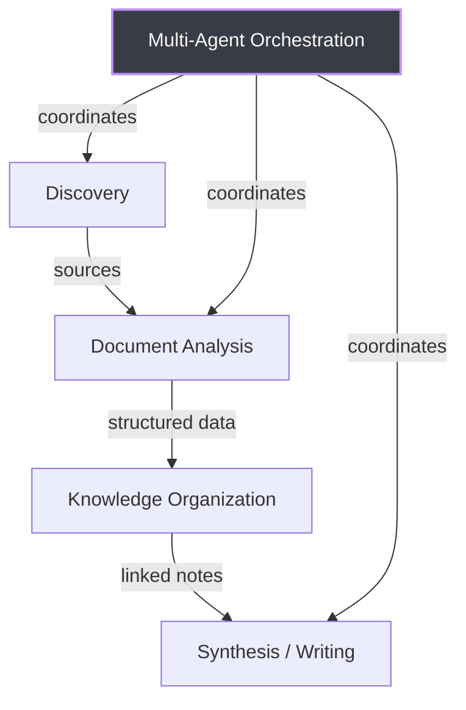

# AI Research Tool Landscape & Manifold Feature Recommendations

## AI Research Tool Landscape — Key Patterns

The research tools ecosystem in 2026 breaks into five layers, and no single tool covers all of them:

| Layer | Leading Tools | What They Do |
|---|---|---|
| **Discovery** | Perplexity, Elicit, Semantic Scholar, Research Rabbit | Find sources, scan literature |
| **Document Analysis** | Humata, Scholarcy, NotebookLM, ChatPDF | Query across uploaded documents |
| **Knowledge Organization** | Obsidian, Heptabase, Tana, Logseq | Link, structure, and spatially arrange ideas |
| **Synthesis/Writing** | Lex, Jenni AI, Claude extended thinking | Turn research into polished output |
| **Multi-Agent Orchestration** | GPT Researcher, CrewAI, LangGraph, STORM | Decompose research into parallel sub-tasks |

**The gap Manifold can uniquely fill:** No tool combines multi-agent parallel orchestration with a local, markdown-native knowledge workspace. Obsidian gets close via MCP plugins but has no native agent coordination. GPT Researcher has great agent pipelines but no persistent workspace. Manifold already has the multi-agent infrastructure — it just needs research-oriented features on top.

---

## Recommended Features for Manifold Research Mode

### Tier 1 — High Impact, Leverages Existing Architecture

#### 1. Enhanced Markdown Experience

The current preview uses basic `ReactMarkdown + remark-gfm`. Research markdown files commonly need:

- **Mermaid diagram rendering** (flowcharts, mind maps, timelines)
- **LaTeX/KaTeX math** (equations in research notes)
- **Footnotes and citation rendering** (`remark-footnotes`)
- **Table of contents / heading outline** navigation in the sidebar
- **WYSIWYG-ish editing** — toggle between source and a richer rendered editor (like Lex or Typora)

This is low-hanging fruit since the preview infrastructure already exists in `CodeViewer.tsx`.

#### 2. Document Outline Panel

A heading-based outline view for the active markdown file (extracted from `# ## ###` headings). Click to jump. This is standard in Obsidian, Notion, Lex, and every serious writing tool. Could live in the existing file tree panel as a toggle.

#### 3. Research Agent Templates

Today Manifold spawns coding agents. Add pre-configured "research agent" templates inspired by GPT Researcher's pipeline:

- **Explorer agent** — given a topic, searches the web and produces a structured overview markdown file
- **Analyst agent** — given a set of source files, synthesizes findings into a comparative analysis
- **Reviewer agent** — reads a draft and provides structured critique with suggestions
- **Writer agent** — takes an outline + source materials and produces a polished document

These are just prompt templates + runtime configs. Each runs in its own worktree, producing `.md` files that the user reviews in Manifold's existing viewer.

#### 4. Cross-File Search with Context

The current `SearchResults` component does file search. Upgrade it with **semantic snippets** — show surrounding context for matches, and support searching across all open agent worktrees simultaneously. Researchers constantly need to find where a concept appears across their notes.

### Tier 2 — Medium Effort, Strong Differentiation

#### 5. Wikilink Support (`[[links]]`)

This is the #1 feature that separates a research tool from a code editor. Obsidian, Logseq, Roam, Heptabase, and Scrintal all center on bi-directional links. In Manifold:

- Parse `[[note name]]` in markdown files
- Cmd+click to navigate to the linked file
- Show backlinks in a panel ("What links to this file?")
- This works naturally with the existing file tree + Monaco editor

#### 6. Multi-Document Chat/Query Panel

Inspired by Heptabase's AI chat and Humata's cross-document Q&A: a panel where the user selects multiple markdown files and asks questions across them. The agent uses RAG (or just context-window stuffing for smaller collections) to answer grounded in the user's own notes. This is the "chat with your research" pattern that NotebookLM, Humata, and Obsidian Smart Connections all offer.

#### 7. Human-in-the-Loop Checkpoints

The dominant UX pattern from LangGraph, OpenAI Deep Research, and GPT Researcher: the agent **pauses at defined checkpoints**, surfaces its current plan/findings, and waits for user approval before continuing. For Manifold:

- Agent produces an outline, pauses, user reviews/edits, agent continues with full draft
- Agent gathers sources, pauses, user removes irrelevant ones, agent synthesizes
- This maps naturally to the existing `StatusDetector` — add a `checkpoint` status alongside `running`/`waiting`/`done`

#### 8. Side-by-Side Document Comparison

Manifold already has diff view for git changes. Extend it to compare **any two markdown files** side-by-side (not just git versions). Researchers constantly compare drafts, source documents, and different agents' outputs on the same topic.

### Tier 3 — Ambitious, Visionary

#### 9. Knowledge Graph View

Visualize the link structure across all markdown files in a project. Obsidian's graph view is the gold standard — nodes are files, edges are `[[links]]`. In Manifold, this could show connections across agent worktrees too, revealing how different agents' research relates. A lightweight force-directed graph using d3 or a similar library.

#### 10. Research Canvas / Spatial View

Inspired by Heptabase and Scrintal: a freeform canvas where the user can drag markdown files (or excerpts) as cards and spatially arrange them. This is the "thinking space" that visual researchers need — spatial proximity encodes conceptual relationships. This is a larger lift but would be a genuine differentiator: no multi-agent tool has a canvas view.

#### 11. Source Provenance Tracking

When an agent produces a research document, automatically track which web sources or input files contributed to each section. Inspired by Elicit's citation tracking and Perplexity's inline citations. Store provenance as metadata (frontmatter or sidecar files) so the user can always trace claims back to sources.

#### 12. Agent Pipeline Orchestration

Inspired by GPT Researcher / CrewAI: let the user define a **research pipeline** where Agent A's output feeds into Agent B's input automatically. Example: Explorer -> Analyst -> Writer, where each step produces markdown that the next agent consumes. This extends Manifold's existing parallel-agent model into a sequential/DAG workflow.

---

## Why This Is Compelling

Manifold's unique position is: **multi-agent orchestration + local file ownership + git-native workflow**. The research tool market in 2026 has:

- **Cloud-locked tools** (Notion, Mem, Tana) — no local file ownership
- **Local-first tools** (Obsidian, Logseq) — no native agent orchestration
- **Agent frameworks** (CrewAI, LangGraph) — no user-facing workspace
- **Deep research agents** (Perplexity, OpenAI) — no persistent knowledge management

Manifold can be the tool where multiple AI agents research in parallel, each in their own worktree, producing markdown files that the user owns locally, reviews with rich preview, connects with wikilinks, and synthesizes into final outputs — all with git history for every step.

---

## Detailed Tool Research

### Category 1: AI-Powered Note-Taking & Knowledge Management

#### Notion AI
- All-in-one AI workspace with docs, wikis, databases, and autonomous agents
- AI Agents run background tasks autonomously (Business plan, $20/user/month)
- Block-based editor, not markdown-native — data lives in Notion's proprietary format
- No multi-agent coordination primitives

#### Obsidian + AI Plugins
- Local-first, markdown-native personal knowledge base with 1,000+ community plugins
- **Smart Connections plugin**: RAG over entire vault, chat grounded in your own notes
- **MCP integration (2026)**: Claude Code can read, write, and navigate vaults programmatically
- All notes are plain `.md` files — full data portability
- 1.5 million users as of February 2026

#### Mem.ai
- Self-organizing AI workspace — AI handles structure, tagging, retrieval automatically
- No manual folders or tags; chat-with-notes is primary retrieval
- Limited markdown support; content in proprietary format
- ~$8-10/month

#### Reflect
- End-to-end encrypted note-taking with AI features
- Calendar integration creates temporal knowledge graph
- Best for privacy-sensitive research (journalists, lawyers, therapists)
- ~$10/month

#### Tana
- Structured outliner with "Supertags" — tags define typed objects with fields
- AI agents understand object types, enabling context-aware automation
- Access to 20+ AI models with `@mention` note context
- Not markdown-native; outliner/graph format

#### Heptabase
- Visual-first research tool built around infinite whiteboards with card-based notes
- **Research mode**: Upload PDFs, YouTube links, .docx — auto-parses into structured whiteboard
- AI chat on canvas with multi-source context (PDFs, videos, cards)
- Bi-directional card linking with visual connections across whiteboards
- MCP Server integration (2026) for external agent access
- Exports to Markdown (Obsidian-compatible)

#### Napkin AI
- Two products: (1) idea capture with AI clustering and "Dynamic Resurfacing" of past notes, (2) text-to-visual diagram generation
- Not markdown-native

### Category 2: AI Research Assistants

#### Elicit
- Literature review automation across 138M academic papers and 545K clinical trials
- **Extraction tables**: Define fields, Elicit populates structured data across entire corpus
- Unmatched for systematic review screening at scale
- Output is structured tables/summaries, not markdown-native

#### Consensus
- Answers scientific questions with a "Consensus Meter" aggregating findings across 200M+ papers
- Best for quick yes/no evidence synthesis on research claims
- Not a deep analysis engine; pair with Elicit for full workflows

#### Semantic Scholar
- Free AI-powered academic search (Allen Institute for AI)
- 200M+ papers, NLP-based recommendations, TLDR summaries
- Powers the index behind Consensus and other tools

#### Research Rabbit
- Visual discovery maps from seed papers — "Spotify for academic papers"
- Continuous recommendations as new papers are published
- Free; integrates with Zotero

#### Connected Papers
- Citation neighborhood visualization for a single paper
- Best for fast one-off exploration around a known paper

#### Perplexity AI (with Deep Research)
- AI search engine with real-time web retrieval + LLM reasoning
- **Deep Research mode**: 2-4 minute autonomous research producing comprehensive reports
- Powered by Opus 4.5 for Pro/Max users; state-of-the-art benchmarks
- Multi-model access and persistent memory across models (March 2026)

### Category 3: AI Writing & Synthesis Tools

#### Lex
- AI co-pilot for human writers — augments rather than replaces
- Swappable LLM backends (Claude, GPT-4o, etc.)
- Knowledge base upload for persistent project context
- Real-time collaborative editing

#### Jenni AI
- Academic writing assistant with AI autocomplete tuned for academic register
- Citation suggestions from 250M+ academic works inline as you write
- PDF Chat for querying uploaded papers
- Export to .docx, HTML, LaTeX

#### Google NotebookLM
- Source-grounded AI assistant — answers strictly from uploaded documents
- Accepts: Google Docs, PDFs, markdown, URLs, YouTube, audio, images
- **Deep Research mode (2026)**: Autonomous web research with auto-sourcing into notebook
- **Audio Overviews**: Podcast-style discussions of documents (80+ languages)
- **Video Overviews**: Document-to-video with AI narration
- Free via Google Workspace

### Category 4: Multi-Agent Frameworks

#### CrewAI
- Dominant high-level orchestration framework (~70% of AI-native workflow builds)
- Role-based agents (researcher, analyst, writer, critic) with context sharing
- Tasks can declare `markdown: true` for formatted output
- Two modes: "Crews" (autonomous collaboration) and "Flows" (deterministic pipelines)

#### AutoGen / Magentic-One (Microsoft)
- Event-driven architecture with Orchestrator + specialist sub-agents
- **Magentic-UI**: Human-in-the-loop interface exposing agent plans, pause-before-execution
- Dynamic task decomposition at runtime (vs. CrewAI's upfront task list)

#### LangGraph (LangChain)
- Multi-agent workflows as directed graphs with cyclical support
- **Interrupt-and-resume pattern**: Agent pauses, persists state, human reviews and edits before resuming
- Shared graph state as scratchpad for artifacts
- `open_deep_research` reference implementation outputs markdown reports

#### GPT Researcher
- Purpose-built autonomous research agent (millions of downloads)
- STORM-inspired pipeline: Editor -> Researcher -> Reviewer -> Revisor -> Writer
- Parallel sub-topic research with strict separation of concerns
- **Markdown is primary interchange format** — web pages converted to clean markdown
- MCP connections for custom data sources (February 2026)

#### STORM / Co-STORM (Stanford)
- Generates full-length, cited research articles from a topic
- Simulates expert panel discussions before writing
- **Co-STORM**: Human participates in round-table with AI expert personas before content generation
- Works against local document collections, not just the web
- Structured draft with citations in ~3 minutes

### Category 5: AI Canvas & Document Analysis Tools

#### Miro AI
- Enterprise visual workspace with AI clustering, summarization, diagram generation
- AI Sidekicks generate action items and extract insights
- Spatial connections only — no semantic linking

#### FigJam AI
- Figma's whiteboard with AI template generation, sticky note sorting, summarization
- Design-team focused; lighter than Miro

#### Scrintal
- Visual note-taking with spatial canvas + bi-directional backlinks
- AI can transform boards into written reports
- "Most customizable knowledge graph" with graph algorithm highlighting most-connected cards

#### Kosmik
- Infinite canvas with built-in browser, AI auto-tagging, proactive content suggestions
- Best multimedia support (20+ file formats, video playback on canvas)
- Strongest for visual/multimedia researchers

#### Humata AI
- Document collections as queryable knowledge base
- **Cross-document querying**: Upload related papers, ask comparative questions
- Inline citations with page references
- Supports PDFs, Word, spreadsheets, scanned images (OCR)

#### Scholarcy
- Converts papers into structured interactive Summary Flashcards
- Extracts figures, tables, methods, results, conclusions
- Zotero integration; 600K+ users

### Category 6: Deep Research Agents

#### OpenAI Deep Research (o3-deep-research)
- Fully autonomous: decomposes query, iterative multi-step web search, synthesizes hundreds of sources
- MCP integration for private data sources (February 2026)
- Real-time progress tracking with mid-run interruption
- Available via API

#### Google Gemini Deep Research (Gemini 3 Pro)
- Autonomous loop: planning, searching, reading, reasoning
- 46.4% on Humanity's Last Exam benchmark
- Specifically trained to reduce hallucinations
- Available via Gemini API

#### Perplexity Deep Research
- Five-stage pipeline: decomposition -> retrieval -> synthesis -> verification -> final report
- Dozens of parallel searches per subtopic
- Conflicting claims flagged and double-checked
- State-of-the-art on Deep Search QA benchmarks

---

## Cross-Cutting Industry Patterns (2026)

### Markdown as Universal Interchange Format
Agents convert all retrieved content (web pages, PDFs, database records) into clean Markdown before passing to downstream agents. CLAUDE.md, AGENTS.md, and similar context files are used as persistent agent memory. Markdown is the lingua franca of multi-agent knowledge work.

### Human-in-the-Loop Interrupt/Resume
The dominant UX pattern: agent pauses at checkpoints, persists state, surfaces plan and findings to human. Human can edit, add/remove sources, or approve. Supported natively in LangGraph, OpenAI Deep Research, and GPT Researcher.

### Hierarchical Orchestration (Lead + Sub-agents)
Lead orchestrator plans strategy and decomposes task; specialist sub-agents execute in parallel; synthesis agent assembles final artifact. Anthropic's internal evaluation found this outperforms single-agent by 90.2% on research benchmarks.

### Separation of Thinking and Execution
One tool handles research/reasoning (Perplexity, Claude, Deep Research); a separate tool handles execution/file production (Cursor, LangGraph, CrewAI). Deliberately kept separate rather than merged.

### Agent Context Files as Persistent Memory
CLAUDE.md and AGENTS.md have evolved into a standard for project-scoped agent memory across sessions. For research workflows, the equivalent is a "research brief" or "methodology" markdown file governing agent behavior.
